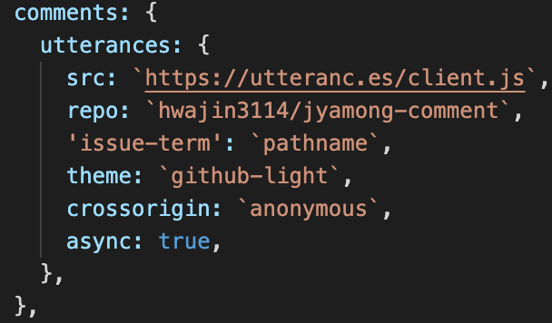
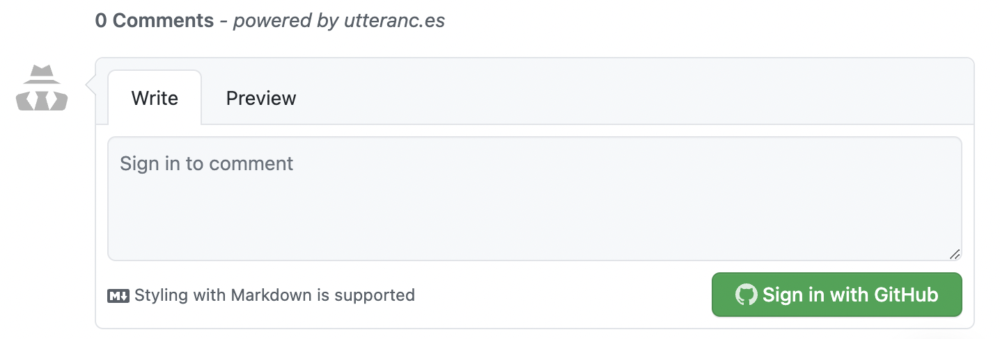

새로 Gatsby 블로그를 개설하고 댓글 기능을 추가하기로 했다.

## Repository 생성 및 Utterances 적용

### 1. public Repository 생성

블로그를 올리는 Repostoriy와 별개로 댓글만을 관리하는 Repository를 생성한다.

### 2. Utterances 앱 설치

> 🦄 utterances 앱 설치는 [링크](<[Utterances](https://github.com/apps/utterances)>)를 참고해주세요!

우측에 녹색 설치 버튼을 클릭하고, `Only select repositories` 항목을 선택해서 생성한 댓글 Repository를 설정한다.

### 3. 스크립트 추가

[Utterances](<(https://utteranc.es/)>) 에서 repo 및 Blog Post & Issue Mapping을 입력하면 설치 스크립트가 자동 생성된다.


```js
<script
  src="https://utteranc.es/client.js"
  repo="[사용자명]/[repo명]"
  issue-term="[포스트 페이지 매핑 방법]"
  theme="[선택한 테마]"
  crossorigin="anonymous"
  async
></script>
```

자동으로 생성된 스크립트를 참고해서 `gatsby-meta-config.js`에 내용을 추가해 준다.


### 4. 결과 화면



## Reference

https://sungchul-p.github.io/gatsby-utterances
