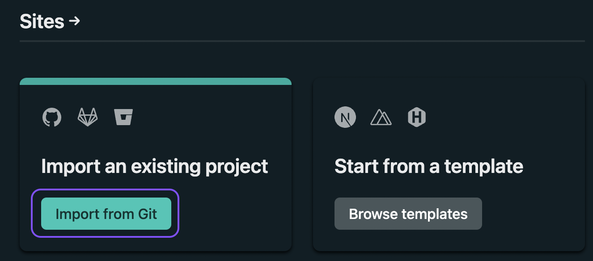
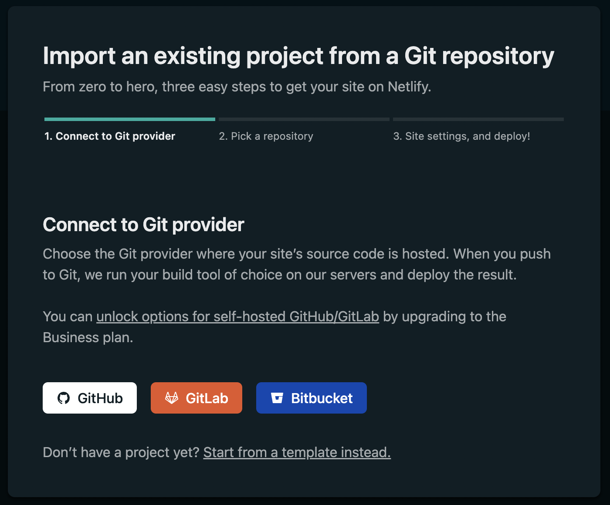
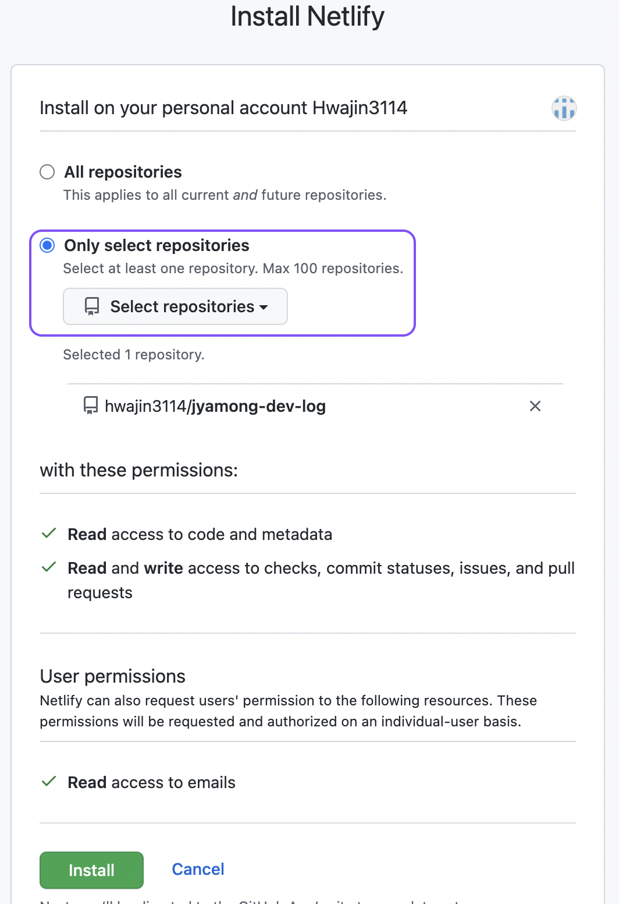
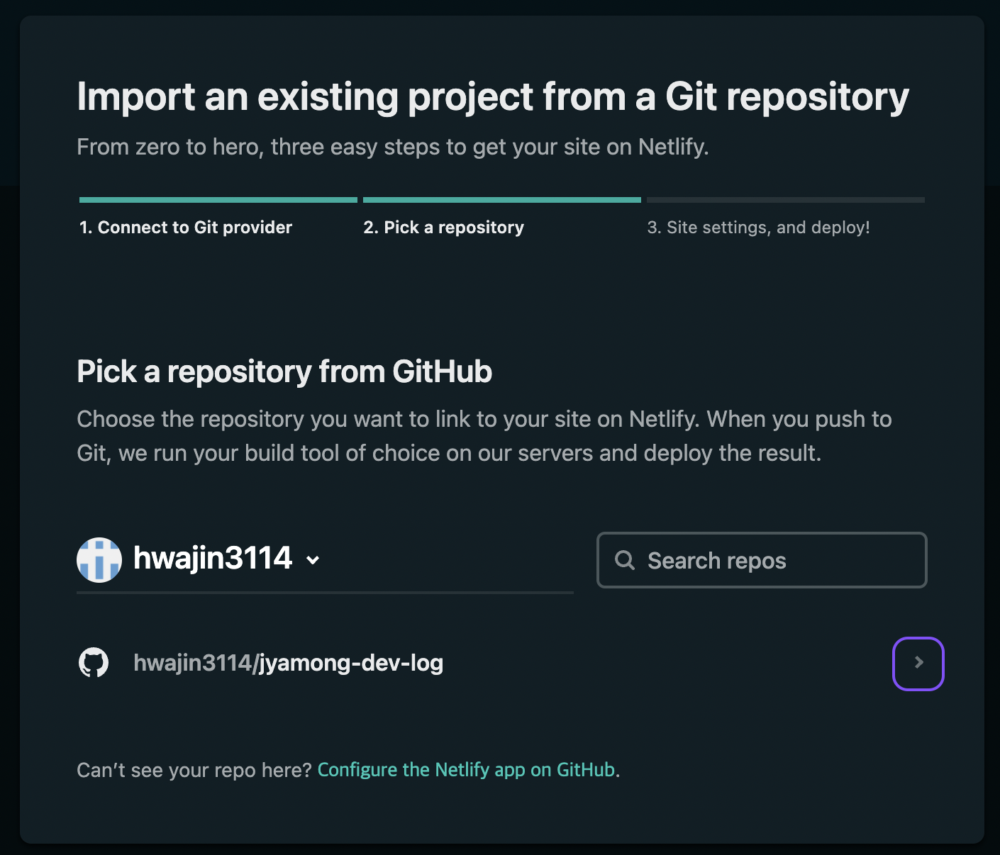
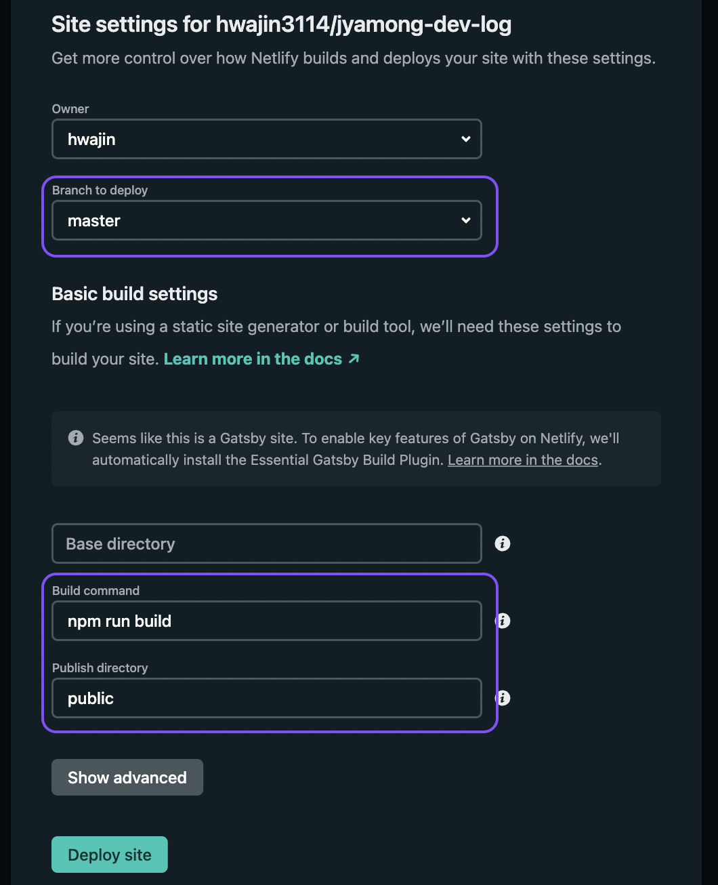
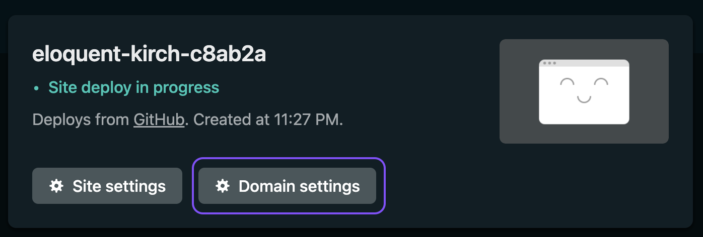
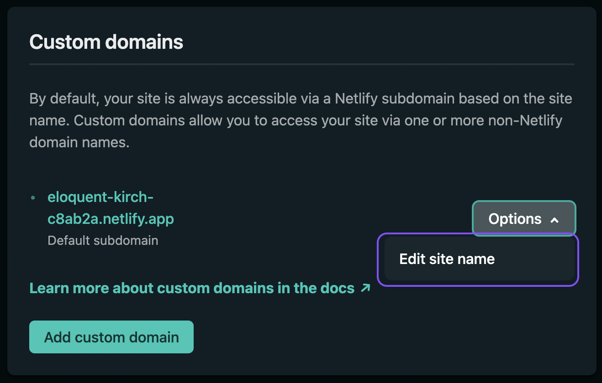
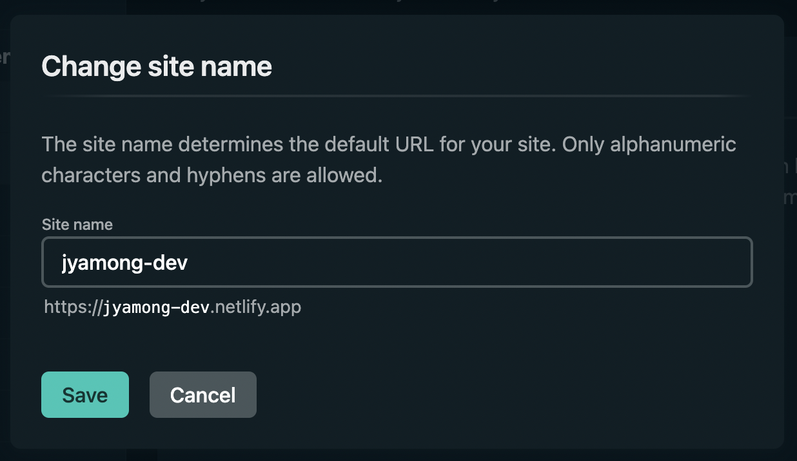

이번에는 Netlify로 Gatsby 블로그를 자동 배포할 것이다.
github 로그인과 Repository 설정, 빌드 커맨드 추가만으로 쉽게 배포를 진행할 수 있다.

[Netlify 홈페이지](https://app.netlify.com)

## 1. git에서 import

좌측에 있는 `Import from Git` 녹색 버튼을 클릭한다.

연동 할 Git provider(`GitHub`)를 선택한다.

`Only select repositories` > 블로그 Repository를 선택하고 `Install` 한다.

## 2. Site settings

Branch to deploy, Build command, Publish directory를 설정한다.

- Branch to deploy : master
- Build command : npm run build
- Publish directory : public

설정을 다하고 `Deploy site`를 누르면 build > deploy를 진행한다.

## 3. Domain settings

빌드 후 블로그 사이트의 대시보드가 생성된다. 생성 직후 이미지와 같이 이름이 임의로 정의된다.
그렇기 때문에 내가 원하는 이름으로 변경해주도록 하자. `Domain settings`를 클릭한다.

Options > Edit site name을 클릭하여 netlify.app 앞부분을 원하는 이름으로 변경할 수 있다.

## 4. 결과 화면

https://jyamong-dev.netlify.app/

## Reference

https://uzzam.dev/blog/auto-deploy-blog-on-netlify/
